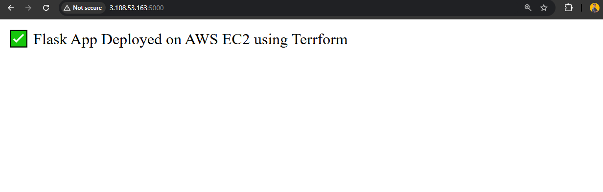
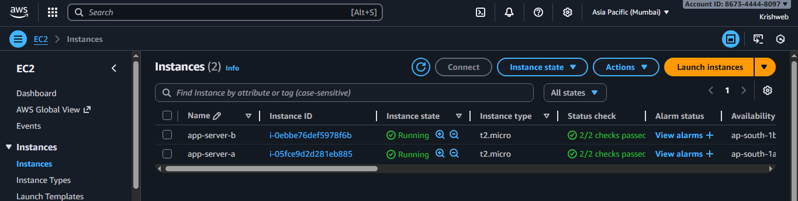
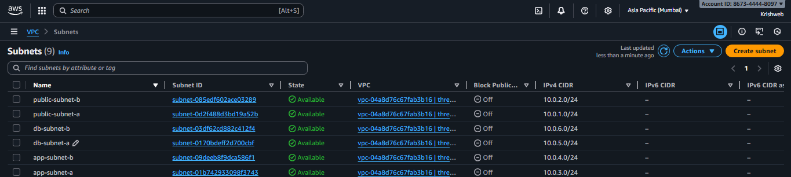

# 3-Tier AWS Architecture using Terraform


---

## Project Overview

**Problem Addressed:** Modern web applications require high availability, scalability, and security. Deploying all application components on a single server creates a single point of failure and makes scaling inefficient. Furthermore, manually provisioning cloud infrastructure is error-prone and difficult to reproduce.

**Objectives:** This project demonstrates a robust, automated deployment of a **3-Tier Web Application Architecture** on AWS using **Terraform**. By separating the Presentation, Application, and Database tiers, the infrastructure is inherently scalable and secure. This project serves as a showcase of Infrastructure as Code (IaC) principles for an internship presentation and professional portfolio.

---

## AWS Architecture and Request Flow

The architecture follows a strict 3-tier design deployed within a custom VPC spanning two Availability Zones:

**Request Flow:**
`User -> Application Load Balancer -> EC2 Flask application instances -> RDS MySQL`

1. **Presentation Tier (Public Subnets):** An Internet Gateway allows traffic in. An Application Load Balancer (ALB) receives HTTP requests and securely distributes them.
2. **Application Tier (Private Subnets):** EC2 instances host a Python Flask web application. These instances do not have public IP addresses and are only accessible via the ALB.
3. **Database Tier (Private Subnets):** A Multi-AZ Amazon RDS (MySQL) instance serves as the data layer. It is fully isolated from the internet and only accepts traffic from the Application tier. *(Note: While network integration is fully configured via security groups, application-level database integration is currently pending because connection parameters are not yet passed to the EC2 instances, and the original Flask app repository is unavailable).*

---

## Technologies Used

| Technology | Purpose |
|------------|---------|
| **AWS VPC** | Virtual Private Cloud providing a logically isolated network for the infrastructure, securing resources across public and private subnets. |
| **AWS EC2** | Elastic Compute Cloud providing virtual servers acting as the Application Tier to run the web application. |
| **AWS ALB** | Application Load Balancer routing incoming web traffic safely across multiple EC2 instances to ensure high availability. |
| **Amazon RDS (MySQL)** | Managed relational database service providing the Database Tier with Multi-AZ redundancy and automated backups. |
| **Terraform** | Infrastructure as Code (IaC) tool used to define, provision, and manage the AWS resources predictably and consistently. |
| **Python** | High-level programming language used to build the application logic. |
| **Flask** | Lightweight Python web framework used to serve the application and handle HTTP requests. |

---

## Project Structure

```text
aws-three-tier-cloud-deployment/
│
├── Terraform/
│   ├── main.tf              # Defines the core infrastructure (VPC, EC2, RDS, ALB)
│   ├── variables.tf         # Input variables allowing dynamic configuration
│   ├── outputs.tf           # Terraform outputs (e.g., ALB DNS endpoint)
│   └── provider.tf          # AWS provider and region configuration
│
├── Architecture.txt         # Detailed ASCII diagram of the system's architecture
├── assets/                  # Directory containing architecture, AWS console, and deployment verification images
├── .gitignore               # Excludes sensitive files, credentials, and state from source control
└── README.md                # Project documentation and setup guide
```

---

## Security Best Practices

Security is a primary focus of this project. The following practices have been strictly enforced:
- **No Hard-coded Secrets:** Database passwords and AWS credentials are not stored in source code.
- **`.gitignore` Enforced:** Terraform state files (`*.tfstate`), variable files (`*.tfvars`), environment files (`.env`), and AWS credentials/private keys must never be committed to GitHub. 
- **Network Isolation:** Only the ALB is exposed to the internet. EC2 and RDS instances sit in private subnets with restricted Security Groups.

### Known Limitations
- **Application Repository Unavailable:** The `flask-app` repository originally used in the EC2 `user_data` script is no longer available (404 Not Found). Deployment of the EC2 instances will succeed, but the web application will fail to start.
- **Database Connection Strings:** The `user_data` script currently lacks the environment variables required to pass the RDS endpoint and credentials to the application.

---

## Setup and Deployment Instructions

### Prerequisites
1. **AWS CLI:** Installed and configured with appropriate IAM permissions. Do **not** place AWS credentials inside the project folder.
2. **Terraform:** Installed on your local machine.
3. **Secure Variables:** Set your database password as an environment variable to inject it safely:
   
   **Linux/macOS:**
   ```bash
   export TF_VAR_db_password="YourSecurePasswordHere!"
   ```
   **Windows (PowerShell):**
   ```powershell
   $env:TF_VAR_db_password="YourSecurePasswordHere!"
   ```

### Deployment Steps
1. **Clone the Repository:**
   ```bash
   git clone https://github.com/Madhumitxx13/aws-three-tier-cloud-deployment.git
   cd aws-three-tier-cloud-deployment/Terraform
   ```

2. **Initialize Terraform:**
   Downloads required providers and initializes the working directory.
   ```bash
   terraform init
   ```

3. **Validate Configuration:**
   Checks the syntax and validity of the Terraform files.
   ```bash
   terraform validate
   ```

4. **Review the Execution Plan:**
   Generates a plan showing what resources will be created.
   ```bash
   terraform plan -out plan.out
   ```

5. **Deploy the Infrastructure:**
   Provisions the infrastructure on AWS.
   ```bash
   terraform apply plan.out
   ```

### Cleanup
To avoid incurring unnecessary AWS charges, destroy the infrastructure when you are done testing:
```bash
terraform destroy -auto-approve
```

---

## Representative Results

This section demonstrates the deployment verification and infrastructure evidence across all tiers of the 3-Tier AWS Architecture. *(Note: The screenshots provided below are inherited from the original author's reference implementation to illustrate the expected outcome, as my current execution does not include a live deployment of the web app.)*

---

### 1. Application & Presentation Tier
The Flask application is publicly reachable via the Application Load Balancer (ALB) endpoint, routing incoming HTTP traffic to the private application instances.

#### Web Application Live Output

*Figure 1: Flask web application responding successfully through the Application Load Balancer.*

#### Application Load Balancer Configuration

*Figure 2: AWS Application Load Balancer active and distributing traffic across target instances in multiple Availability Zones.*

---

### 2. Application Tier (EC2 Compute Instances)
The compute tier runs Python Flask instances in isolated private application subnets, ensuring no direct public internet exposure.

#### EC2 Application Instances

*Figure 3: EC2 application instances healthy and running across multiple Availability Zones.*

---

### 3. Database Tier (Amazon RDS MySQL)
Managed relational database configured with Multi-AZ redundancy within dedicated, secure private database subnets.

#### Multi-AZ RDS Database Instance

*Figure 4: Amazon RDS MySQL instance deployed in Multi-AZ mode for automated failover and high availability.*

---

### 4. Networking & VPC Infrastructure
Virtual Private Cloud (VPC) configured with public subnets, private application subnets, and private database subnets with strict routing tables.

#### VPC Resource Map

*Figure 5: Complete AWS VPC Resource Map illustrating subnet distribution, route table associations, and internet/NAT gateways.*

#### VPC Configuration

*Figure 6: Custom VPC configured with isolated IPv4 CIDR block.*

#### Subnets Allocation

*Figure 7: Dual-AZ Subnets categorized by tier (Public Web, Private App, Private DB).*

#### Route Tables & Association

*Figure 8: Route tables ensuring strict tier-based network isolation and routing.*

---

### 5. Terraform Infrastructure as Code (IaC) Execution
End-to-end automation logs showcasing configuration validation, planning, execution, and outputs.

#### Terraform Configuration Validation

*Figure 9: `terraform validate` verifying syntax and configuration correctness.*

#### Terraform Execution Plan


*Figure 10: `terraform plan` execution graph outlining resources scheduled for provisioning.*

#### Terraform Apply & Infrastructure Provisioning


*Figure 11: `terraform apply` successfully creating all VPC, ALB, EC2, and RDS resources.*

#### Terraform Outputs & Resource Summary


*Figure 12: Terraform outputs exposing ALB DNS name, EC2 private IPs, and RDS database endpoint.*

---

## Acknowledgements

- **Reference Project:** This project is based on a reference implementation by **Jothi Krishna M**. 
- **Original Repository:** [https://github.com/KrishnaaCloud/3-Tier-AWS-Infra-Using-Terraform](https://github.com/KrishnaaCloud/3-Tier-AWS-Infra-Using-Terraform)
- **Modifications:** I have adapted this repository for my internship portfolio. My contributions include securing the Terraform code by removing hard-coded credentials, updating the `.gitignore` to prevent secret leakage, restructuring the documentation, and validating the architectural security. 
